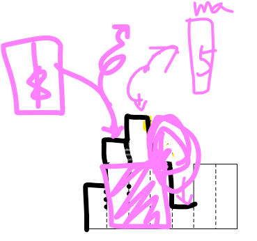

## 9/17/목, 희연이 빼고
각자 2개씩


```python
# 시간 단위는 분
if 도착시간 > 시작시간 :
    벌금 += math.ceiling((도착시간-시작시간) / 5) * 500

# 'problems' is a list of problems
# 'hosts' is a list of all host who participate in the group study.
# each 'problem' has a 'host' who picks it.

for p in problems:
    for h in hosts:
        if not p.accepted and not p.explained :
            h.벌금 += 2000

        if not p.accepted and p.host is h:
            h.벌금 += 2000
```

- [x] 치즈
https://www.acmicpc.net/problem/2636

- [x] 히스토그램
https://www.acmicpc.net/problem/1725

- [x] 수식 최대화
https://programmers.co.kr/learn/courses/30/lessons/67257

- [ ] 단어 퍼즐
https://programmers.co.kr/learn/courses/30/lessons/12983


---


### 치즈
https://www.acmicpc.net/problem/2636

- `g[nx][ny]`를 `g[ny][ny]`로 쓰는 휴먼 에러는 대체 어떻게 잡아야 할까요?

```c++
#include <iostream>
#include <queue>
#include <utility>
#define DEB 0
using namespace std;
using pii = pair<int, int>;

int g[100][100]{ 0 };
int d[5] = { -1, 0, 1, 0, -1 };
int m, n;

int main() {
	cin.sync_with_stdio(0);
	cin.tie(NULL);

	cin >> m >> n;
	for (int i = 0; i < m; i++)
		for (int j = 0; j < n; j++)
			cin >> g[i][j];

	int cnt = 0, next_cnt = 1, hour = 0;
	while (next_cnt) {
		cnt = 0;
		next_cnt = 0;

		hour++;
		queue<pii> q;
		bool v[100][100]{ false };

		v[0][0] = true;
		q.push({ 0,0 });

		while(!q.empty()){
			int x = q.front().first;
			int y = q.front().second;
			//cout << "(" << x << ", " << y << ")  ";
			q.pop();
			for(int i=0;i<4;i++){
				int nx = x + d[i], ny = y + d[i + 1];
				if (nx < 0 || nx >= m || ny < 0 || ny >= n)
					continue;

				if (v[nx][ny])
					continue;

				if (g[nx][ny] == 1) {
					v[nx][ny] = true;
					continue;
				}

				v[nx][ny] = true;
				q.push({ nx,ny });
			}
		}

		for (int i = 1; i < m - 1; i++) {
			for (int j = 1; j < n - 1; j++) {
				if (g[i][j] == 1 && v[i][j]) {
					g[i][j] = 0;
					cnt++;
				}
				else if (g[i][j] == 1)
					next_cnt++;
			}
		}
#if DEB
		cout << "hour: " << hour << "-------------\n";
		for (int i = 0; i < m ; i++) {
			for (int j = 0; j < n ; j++) {
				cout << g[i][j] <<' ';
			}
			cout << '\n';
		}
		cout << "\n\nvisited\n";
		for (int i = 0; i < m; i++) {
			for (int j = 0; j < n; j++) {
				cout << v[i][j] << ' ';
			}
			cout << '\n';
		}
		cout << "cnt: "<<cnt<<", next_cnt: "<<next_cnt<<"--------\n";
#endif
	}

	cout << hour << '\n' << cnt << '\n';
	return 0;

}
```

---
### 히스토그램
https://www.acmicpc.net/problem/1725

- segment tree 혹은 stack으로 풀 수 있다.
- stack으로 푸는게 더 좋은 방법. 이 문제와 완전히 동일하게(입력만 조금 다르게 받는 방식으로) noj.am/6549 문제도 풀 수 있다.
- 코드의 일관성을 위해 맨 처음과 맨 마지막에 `0`의 높이를 갖는 더미 원소를 만들어줬다.
- `while`문 안의 동작이 기가막힌다. `height`를 구하고 `pop`을 한 뒤 `width`를 나중에 구하는 방법으로 `while`문 안의 조건문과 연결지어서 예쁜 O(n) time complexity를 가질 수 있다.
- `if`문 안의 조건때문에 `st.pop()`의 첫번째 애가 반드시 현재 스택에서 가장 높은 높이를 가진다.
- 또한, `width` 계산시에 가장 넓게 퍼져야 하므로 `st.pop()`의 첫번째 애에서 가장 왼쪽으로 퍼질 수 있게 `pop`연산 이후 `width`를 구해주는 일을 해야한다!
- 

- div and conq로 풀 경우, `left`, `mid`, `right` 설정이 까다로우니 외워서 알고 가야하는 것을 원주와 상의했음!
참고: https://stackoverflow.com/questions/25571359/why-we-write-lohi-lo-2-in-binary-search

```c++
#include<iostream>
#include<stack>
#define max(a,b) a>b?a:b
using namespace std;
typedef long long ll;

ll n, h[100002]{ 0 }, ma = 0;

int main() {
	cin >> n;
	h[0] = 0;
	for (int i = 1; i <= n; ++i)
		cin >> h[i];
	h[n + 1] = 0;

	stack<int> st;
	st.push(0);

	for (int i = 1; i <= n + 1; i++) {
		while (!st.empty() && h[st.top()] > h[i]) {
			ll height = h[st.top()];
			st.pop();
			int width = i - st.top() - 1;
			ma = max(ma, height * width);
		}
		st.push(i);
	}
	cout << ma << '\n';
	return 0;
}

```

---
### 수식 최대화
https://programmers.co.kr/learn/courses/30/lessons/67257

- brute force. `erase(iter)`와 `while`을 통해 구현

```c++
#include <string>
#include <vector>
#include <iostream>
using namespace std;

vector<long long> nums, nums_o;
vector<char> opers, opers_o;

long long solution(string expression) {
    long long answer = 0;
    string s = "";

    // parsing
    for(auto c: expression){
        if(c == '+' || c == '-' || c == '*'){
            if(!s.empty()){
                nums_o.push_back(stoll(s));
                s = "";
            }
            opers_o.push_back(c);
        }
        else
            s += c;
    }

    nums_o.push_back(stoll(s));

    char order[6][3] = {{'*','+','-'},{'*','-','+'},
                        {'+','*','-'},{'+','-','*'},
                        {'-','*','+'},{'-','+','*'}};

    for(int i=0;i<6;i++){
        nums = nums_o;
        opers = opers_o;
        for(int j=0; j<3; j++){
            vector<long long>::iterator nit=nums.begin();
            vector<char>::iterator oit =opers.begin();
            while(oit != opers.end()){
                if(*oit == order[i][j]){
                    oit = opers.erase(oit);
                    // cout<<*nit<<*oit<<endl;
                    long long tmp = *nit;
                    nit = nums.erase(nit);
                    if(order[i][j] == '*')
                        *nit = tmp * (*nit);
                    else if(order[i][j] == '+')
                        *nit = tmp + (*nit);
                    else if(order[i][j] == '-')
                        *nit = tmp - (*nit);
                }else{
                    nit++;
                    oit++;
                }
            }
        }
        // cout<<nums.size()<<endl;
        nums[0] = nums[0] > 0 ? nums[0] : -nums[0];
        answer = nums[0] > answer ? nums[0] : answer;
    }

    return answer;
}
```

---
### 단어 퍼즐
https://programmers.co.kr/learn/courses/30/lessons/12983

- TLE!
- 고민해봅시다!

```c++
#include <iostream>
#include <string>
#include <vector>
#define min(a,b) a>b?b:a
using namespace std;

int solution(vector<string> strs, string t)
{
    vector<int> dp(t.length()+1, 20001);
    dp[0] = 0;
    for (int i = 1; i < dp.size(); i++) {
        for (auto s: strs) {
            if (i >= s.size()) {
                if(t.substr(i-s.size(), s.size()) == s)
                    dp[i] = min(dp[i - s.size()] + 1, dp[i]);
            }
        }
    }

    return (dp[t.length()] == 20001 ? -1 : dp[t.length()]);
}
```

---
